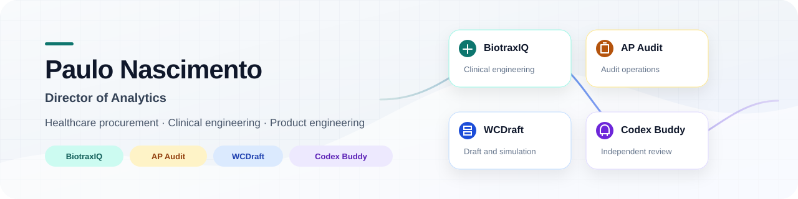
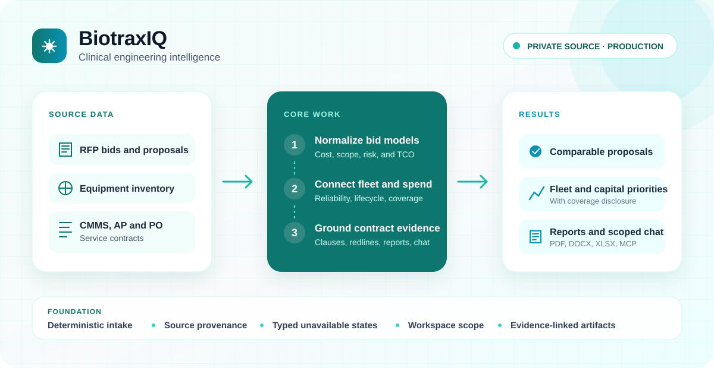
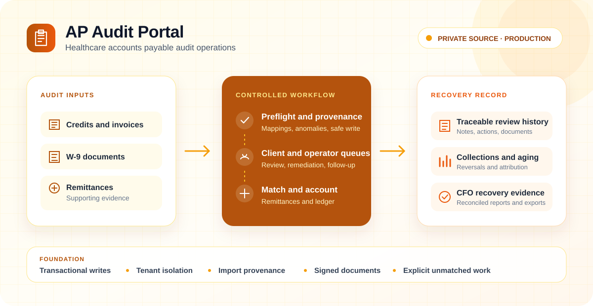
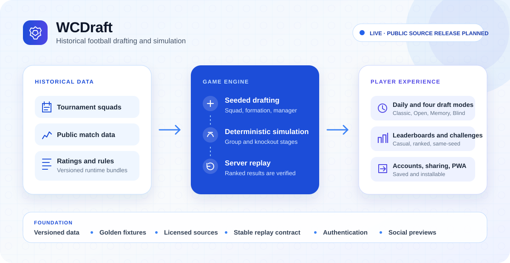
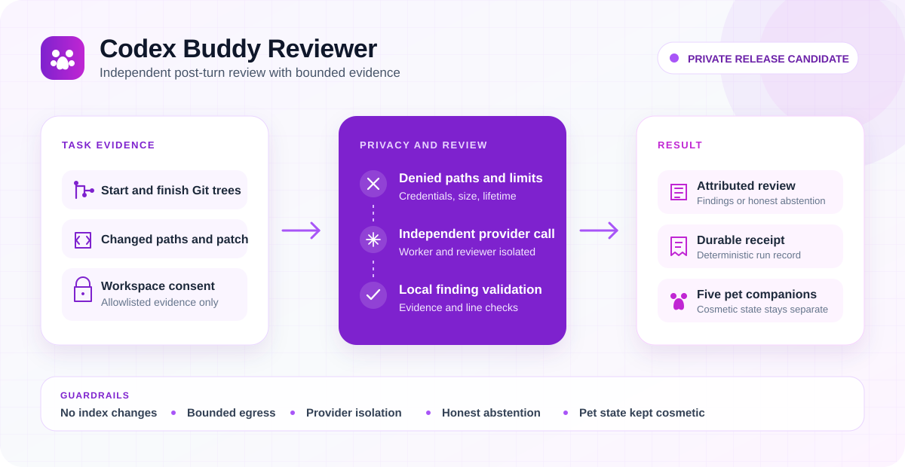

<picture>
  <source media="(prefers-color-scheme: dark)" srcset="assets/profile/header-dark.svg">
  <source media="(prefers-color-scheme: light)" srcset="assets/profile/header-light.svg">
  
</picture>

# Paulo Nascimento

Director of Analytics working in healthcare procurement, clinical engineering, and operational finance. My work spans domain analysis and product engineering, including data models, import pipelines, APIs, frontend workflows, testing, deployment, and day-to-day operations. Current projects also include a football drafting game and a privacy-focused code reviewer for Codex.

[LinkedIn](https://www.linkedin.com/in/paulo-nascimento9596/) · [Email](mailto:paulo@pnascimento.dev) · New Jersey, USA

## Current projects

### BiotraxIQ

*Production deployment · Private source · Demo by request*

<picture>
  <source media="(prefers-color-scheme: dark)" srcset="assets/profile/biotraxiq-dark.svg">
  <source media="(prefers-color-scheme: light)" srcset="assets/profile/biotraxiq-light.svg">
  
</picture>

BiotraxIQ is a clinical engineering intelligence platform for hospital finance, procurement, and HTM teams. It brings RFP bids, medical equipment inventories, CMMS work orders, AP and PO spend, and service contracts into one governed workspace.

The RFP workflow normalizes different pricing models, finds hidden cost and scope risk, applies evidence-aware scoring, and models multi-year TCO. The inventory and equipment workflows cover device classification, EM risk, ghost assets, work-order matching, reliability, lifecycle, and capital planning. Financial and contract workflows connect spend, coverage, terms, clauses, and source-grounded redlines to reporting.

Ask BiotraxIQ provides workspace-scoped chat and MCP access across inventory, equipment, spend, contracts, and TCO. Results retain provenance, and missing evidence remains explicit instead of turning into a zero or a guessed answer.

`Python` · `FastAPI` · `PostgreSQL` · `Next.js` · `TypeScript` · `MCP` · `Vercel` · `Render`

[Product overview](https://github.com/pnascimento9596/biotraxiq-overview) · [Open BiotraxIQ](https://biotraxiq.vercel.app/) · [Request a demo](mailto:paulo@pnascimento.dev)

### AP Audit Portal

*Production deployment · Private source · Public product overview*

<picture>
  <source media="(prefers-color-scheme: dark)" srcset="assets/profile/ap-audit-dark.svg">
  <source media="(prefers-color-scheme: light)" srcset="assets/profile/ap-audit-light.svg">
  
</picture>

AP Audit Portal is a multi-tenant accounts payable audit platform for healthcare organizations. It supports separate operator and client workflows for audit periods, credits, invoice validation, W-9 remediation, remittances, collections, and supporting documents.

Spreadsheet imports use preflight checks, reusable mappings, anomaly handling, provenance records, idempotency controls, and transactional reconciliation. Role-specific task queues are derived from the underlying audit records. Remittance matching keeps exact matches, suggestions, ambiguous rows, and unmatched work separate so an operator can see what still needs judgment.

The portal also covers collection reversals and source attribution, recovery dashboards, CFO evidence exports, signed document delivery, tenant isolation, structured audit history, and guarded release and restore workflows.

`Next.js` · `React` · `TypeScript` · `Drizzle` · `Neon PostgreSQL` · `Cloudflare R2` · `Vercel`

[Product overview](https://github.com/pnascimento9596/ap-audit-portal-overview)

### WCDraft

*Live product · Source private during release preparation · Public source release planned*

<picture>
  <source media="(prefers-color-scheme: dark)" srcset="assets/profile/wcdraft-dark.svg">
  <source media="(prefers-color-scheme: light)" srcset="assets/profile/wcdraft-light.svg">
  
</picture>

WCDraft is a football drafting game built around tournament history from 1930 through 2026. Players assemble an all-time squad, choose a manager and formation, then run the team through a seeded group and knockout simulation.

The game includes Daily, Classic, Open Draft, Memory, and Blind Open modes. It also has accounts, saved runs, casual and ranked leaderboards, same-seed friend challenges, and versioned share links. Ranked submissions are replayed on the server before they are accepted.

The project combines a deterministic TypeScript game engine, a Python data and ratings pipeline, versioned runtime bundles, licensed public data, authentication, Postgres, social previews, and installable PWA delivery.

`Next.js` · `React` · `TypeScript` · `Python` · `PostgreSQL` · `Vercel` · `Playwright`

[Play WCDraft](https://www.wcdraft.com) · [How to play](https://www.wcdraft.com/how-to-play)

Independent fan project. Not affiliated with or endorsed by a football governing body.

### Codex Buddy Reviewer

*Private release candidate · Public installation not yet available*

<picture>
  <source media="(prefers-color-scheme: dark)" srcset="assets/profile/codex-buddy-dark.svg">
  <source media="(prefers-color-scheme: light)" srcset="assets/profile/codex-buddy-light.svg">
  
</picture>

Codex Buddy Reviewer adds an independent post-turn code review to OpenAI Codex. It captures stable Git trees before and after a task without changing the index or refs, computes the changes observed during that window, and sends a bounded allowlisted patch to a separately configured reviewer.

Local controls block common credential paths, limit evidence size and lifetime, validate the returned findings, and record deterministic receipts. If the evidence is incomplete or the provider fails, the review stays separate from the worker result and reports what happened instead of filling in a conclusion.

Five original pet packages add companion state, personality, mood, and completion events. The native pet remains owned and rendered by Codex. Review authorization and technical findings do not depend on the cosmetic layer.

`JavaScript` · `Codex plugins` · `Git snapshots` · `Structured review` · `Privacy controls` · `Pet packages`

## Other current work

### Facilities Command Center

*Production system · Private source*

A healthcare facilities operations platform for project portfolios, contract renewals, follow-up risk, staleness rules, saved views, audited project updates, spreadsheet round-trips, notifications, and secure attachments.

`Next.js` · `React` · `TypeScript` · `Drizzle` · `Neon PostgreSQL` · `Vercel`

## Open source and public work

- [cron-status-alert](https://github.com/pnascimento9596/cron-status-alert) is a Hermes Agent plugin that sends a Discord message when a cron delivery fails or runs overdue.
- [equipcost-forecast](https://github.com/pnascimento9596/equipcost-forecast) covers biomedical equipment lifecycle forecasting, failure curves, NPV and TCO repair-versus-replace analysis, and fleet replacement planning.
- [medspend-normalize](https://github.com/pnascimento9596/medspend-normalize) is a multi-ERP healthcare spend pipeline with vendor resolution, anomaly detection, facility comparison, lineage, an API, and a CLI.
- [ghost-asset-detector](https://github.com/pnascimento9596/ghost-asset-detector) uses seven explicit inventory signals to flag likely ghost assets and explain the classification.
- [ortho-implant-benchmarking](https://github.com/pnascimento9596/ortho-implant-benchmarking) cross-references purchase and catalog data, ranks price opportunities, and produces reports and visualizations.
- [healthcare-spend-dashboard](https://github.com/pnascimento9596/healthcare-spend-dashboard) is a Streamlit and Plotly exploration of synthetic procurement data across categories, vendors, facilities, contract mix, and PPI spend.

Recent upstream work includes statistical comparison and evaluator reliability features in [EvalTrust](https://github.com/k-dickinson/evaltrust), plus asynchronous task cleanup in [RepoPrompt Community Edition](https://github.com/repoprompt/repoprompt-ce).

## Working approach

- Intake and mapping stay deterministic when source identity and scope need to be traceable.
- Missing or contradictory evidence remains explicit instead of turning into zeroes or default claims.
- Financial calculations stay transparent, reproducible, and testable.
- State-changing workflows use transactions, idempotency, and reconciliation where outcomes can be ambiguous.
- AI review is isolated, bounded, and attributed to the reviewer that produced it.

## Contact

[LinkedIn](https://www.linkedin.com/in/paulo-nascimento9596/) · [paulo@pnascimento.dev](mailto:paulo@pnascimento.dev)
